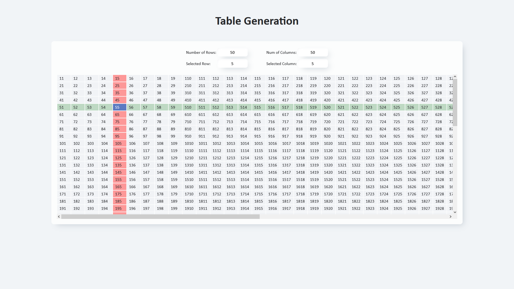
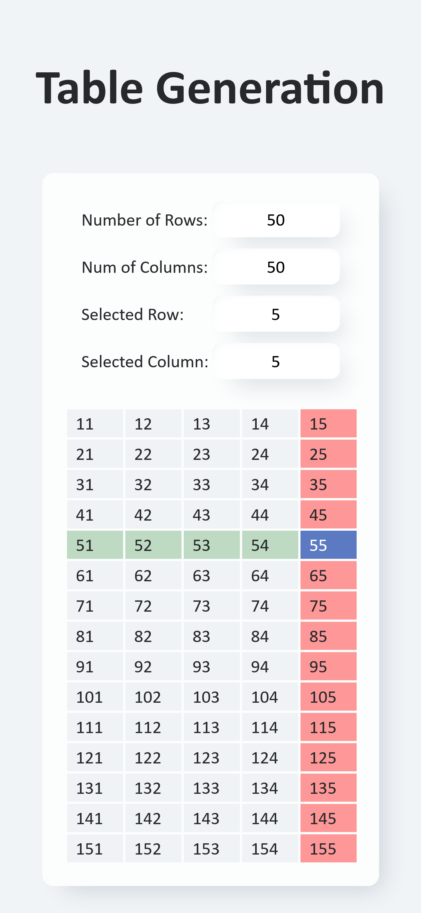

# Table Generation

## Final Result

## Task Description

Your task is to prepare a simple form with 4 fields:
- Number of rows
- Number of columns
- Selected row
- Selected column

After filling all fields by the user your app should generate table with defined
number of rows and columns. It should also change background color of selected row to GREEN and 
background color of selected column to RED.

A cell at the intersection of selected row and column should have background color changed to BLUE.

Besides that every cell should have a number inside indicating its row and column - for example cell 
located in third row and fourth column should have number 34.

Table should be re-created everytime any of those values will change. If any of those values is missing we
should not see any table on the screen.

Feel free to add invalid values validation (values lower than 0 or for example selected row bigger than
available number of rows) for extra points.

*Task description was created by [purbanski-deftcode](https://github.com/purbanski-deftcode).*